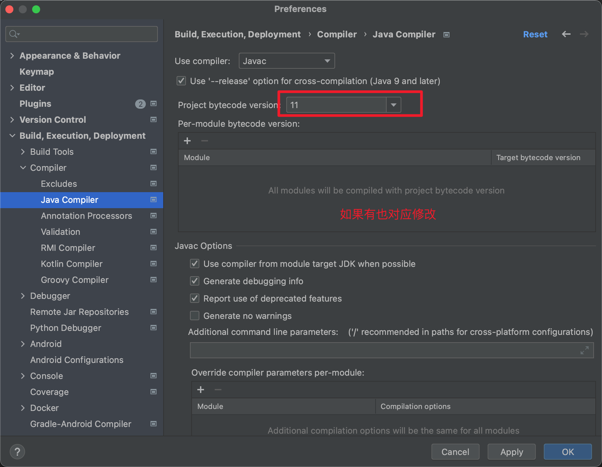
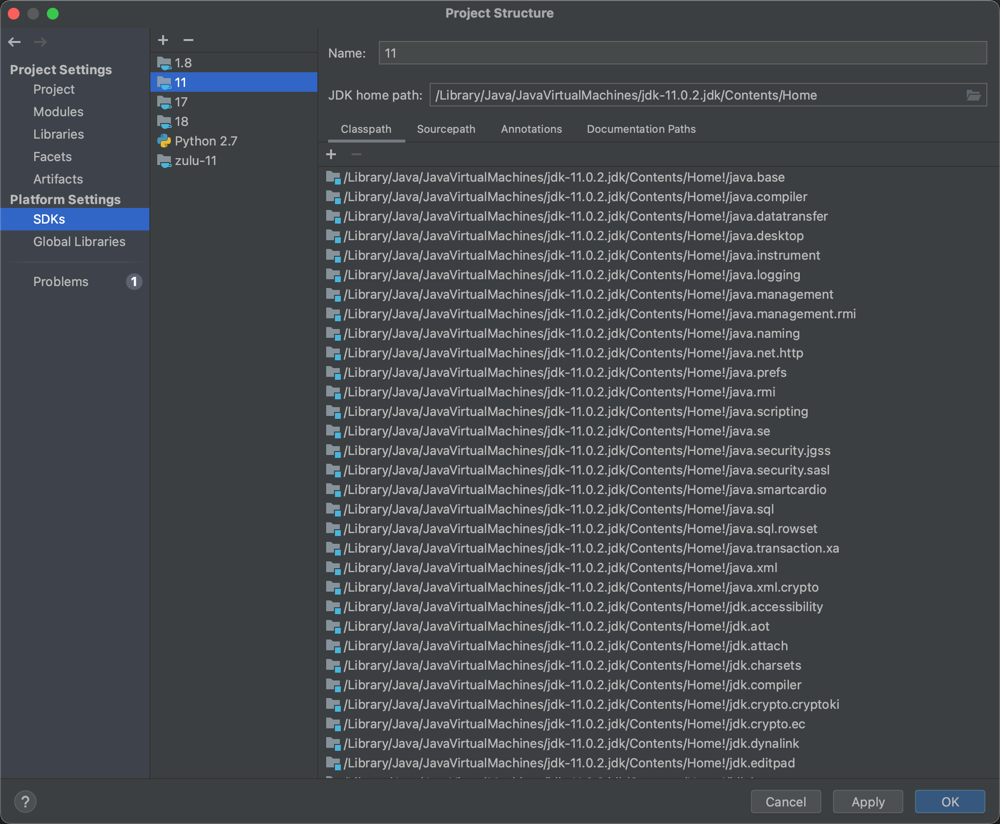
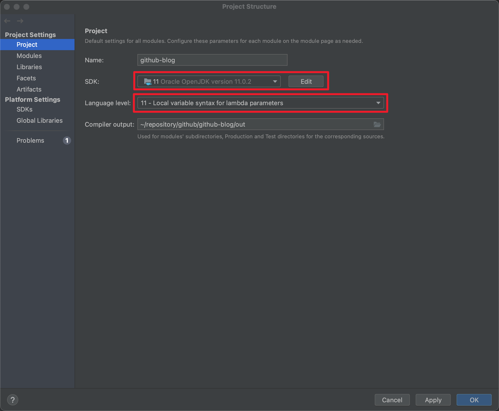
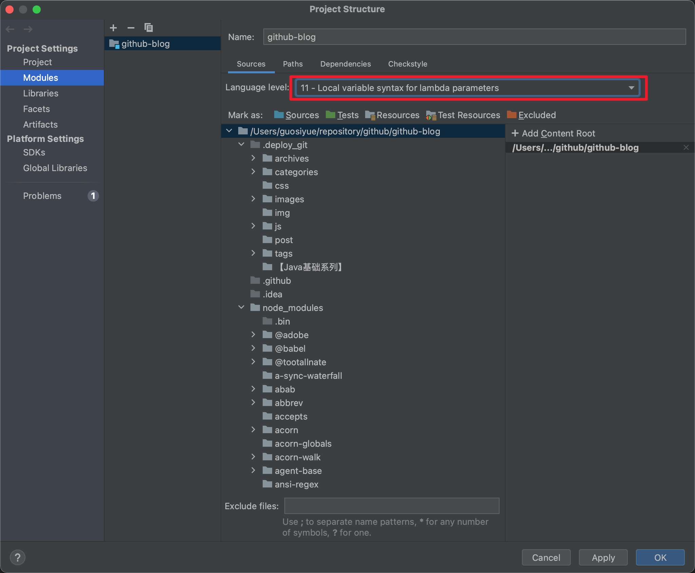
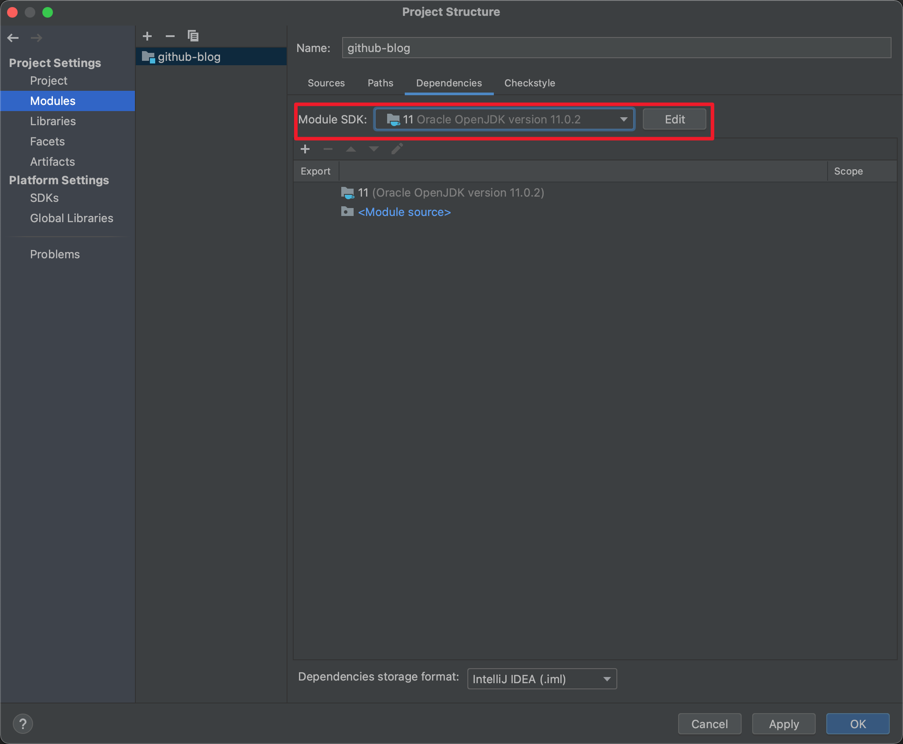

# 背景
在实际开发中偶尔会碰到需要切换JDK版本的情况，就我自己而言，大范围修改JDK版本有两次：

一次是由于我是21年开始使用MAC M1作为主力开发，当时Open JDK兼容性不太好，因此选择了zulu JDK。但不同JDK的实现有些差异，切换后可能会发现部分类丢失等情况导致编译异常。在Open JDK兼容M1版本后，果断将所有项目保持统一切换回Open JDK。

还有一次就是在开发的产品的JDK版本升级，公司要求所有产品都升级到JDK11以上，因此JDK8的老产品都进行了相关升级。

有时会记不清具体需要修改哪些地方导致遗漏，因此写这篇文章记录一下。

1. 修改项目编译使用的JDK版本
首先在主菜单IntelliJ IDEA/preferences（windows版本对应全局settings界面）中，找到Build,Execution,Deployment -> Compiler，修改编译使用的版本，然后Apply。

2. 添加项目JDK版本路径
如果是一个全新版本的JDK，那么需要在主菜单的File -> Project Structure中，找到Project Settings -> Platform Settings -> SDKs中，添加JDK名称和对应路径。

3. 修改项目整体默认使用的JDK版本+路径
还是在Project Structure中，找到Project Settings -> Project，修改JDK 和对应的language level。

4. 修改每个模块使用的JDK版本
这部分可以按需调整，比如某些模块使用JDK8，而其他模块使用JDK11。还是在Project Structure中，找到Project Settings -> Modules，修改source中的JDK 和对应dependencies的language level。

