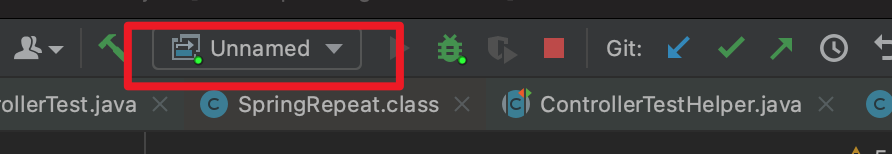
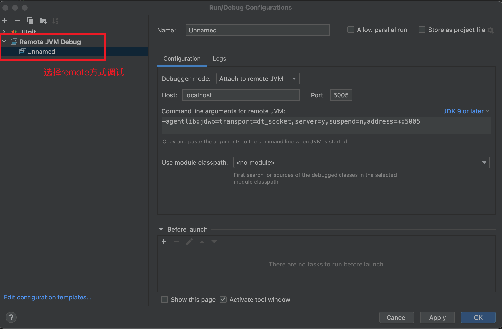
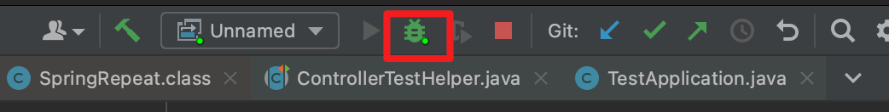

# 远程调试
当我们需要数据一个新的服务代码，例如了解cassandra的启动流程，如果只看代码很容易遗漏一些细节，这个时候可以通过远程调试，一步步来跟踪代码，查看服务运行情况。
1. 调整debug configuration，添加远程debug参数


需要修改的参数：
①Host: 如果是本地启动的服务，可以填写localhost，否则填写服务ip
②Port: 调试端口，注意不要和服务器端的端口冲突。
另外注意公司可能做了端口拦截或防火墙，要保证本地服务是能访问到调试的ip+port。

2. 在启动服务的入口添加参数
例如cassandra，是通过bin/cassandra脚本，执行launch_server方法启动的。我们在脚本中将上面remote JVM参数添加到java启动命令中。其中需要将断点syspend改为y，否则不会在我们打的断点处停下来。
 完整命令类似于：
 ```
 -agentlib:jdwp=transport=dt_socket,server=y,suspend=y,address=5005
 ```
在脚本中修改后类似于：
```
 exec $NUMACTL "$JAVA" $JVM_OPTS -agentlib:jdwp=transport=dt_socket,server=y,suspend=y,address=5005 $cassandra_parms -cp "$CLASSPATH" $props "$class"
```

3. 启动服务，等待debug连接

现在IDEA中点击debug按钮，监听远程服务断点，然后我们执行脚本启动服务，然后就可以在IDEA中调试服务了。

4. 本地测试作为远程服务
当遇到一些集成测试，可能发生case间影响的时候，也可以尝试用这样的方法来调试。唯一不同的就是我们启动单测的方式：
对于mvn，可以执行：
``` mvn
mvn clean verify -Pjacoco -Dtest.env.runningMode=multi  -Dtest=""  
```
对于gradle，则可以执行：
```
./gradlew --info :{submodule}:test --tests="" -Dorg.gradle.debug=true --debug-jvm
```
例如，单跑1个case：
```protobuf
./gradlew --info :iot-tsdb-data-unit-test:test --tests="xxx.MysqlConnectorJTest" --debug-jvm
```
