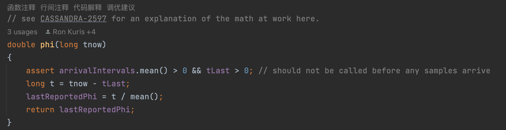

最近由于架构调整刚接手的一个新产品，发现其心跳检测方案存在一些问题。产品本身原来是通过k8s开启headless，然后通过dns解析获取到所有pod的ip，然后通过请求服务的健康检测接口是否返回，来判断服务是否存活。消亡的节点会被放进黑名单中，黑名单会定时失效，失效以后可以再次通过心跳任务来检测服务是否失效。

但由于线上某个网络组件问题，导致某个节点DNS虽然能稳定解析出某个节点，但是会时不时发送消息失败，导致这个节点反复出入黑名单。线上一些大流量客户甚至可感延迟，导致客户体验很差。

想到之前对cassandra较为熟悉，因此我打算仔细调研一下cassandra使用的Phi-Accrual FailureDetector心跳方案，通过可信度来决定是否剔除节点，而不是通过单次访问的结果进行判断，当然还有其他简单的解决方案可以采用，但学习一下优秀的设计方案，还是很有必要的。

那么我们开始吧。

# 什么是Phi-Accrual FailureDetector
Phi-Accrual FailureDetector是Google提出的一种心跳检测方案，cassandra的FailureDetector类注解中提到，『This FailureDetector is an implementation of the paper titled "The Phi Accrual Failure Detector" by Hayashibara.』([原文](https://ieeexplore.ieee.org/document/1353004))。结合论文和源码实现，我们能更好地理解这种阈值和积累型故障检测器。

> 作者是京都产业大学信息科学与工程学院的教授，主要研究都是围绕着分布式服务探测和网络协议。

累积行故障检测器相对传统心跳检测，有1个主要区别：
如果只根据是否能接收到心跳来判断，那么节点状态就只有死亡和存活两种状态。但实际上两者中间由于网络波动，并不是这样一个二态关系，中间还有一种suspect状态。

因此系统可以用一个连续的『可信度』来描述节点是否有故障，这个值我们用Phi表示，并且增加一个失效阈值，从而调整故障检测器的敏感度，敏感度小表示敏感度更高，反之更低，不过两者一般不是成一个线性关系。

# 实现原理
## 累积分布函数
可以看出，计算可信度的方法至关重要，他决定了阈值的选择以及一个节点是否需要被加入黑名单。

指数分布的 "累积分布函数 "有很多实现方法，原论文中建议用高斯分布来近似分布，但cassandra的开发者实验认为指数分布的效果更优秀，这也可能和cassandra使用gossip协议而不是点对点的心跳轮询有关。一般如果是点对点的心跳轮询，那么故障将遵循正态分布，但由于gossip从端点 A 到端点 B 是以随机间隔发送的，它们很可能构成一个泊松过程。

cassandra曾对计算步骤做过[说明](https://issues.apache.org/jira/browse/CASSANDRA-2597)，我们再次梳理理解一下：

假设我们的服务发现方为A，服务注册方为B。P_later表示一个端点 B 不可用的可能性。t 表示 A 收到 B 发出最后一条 Syn/Ack/Ack2 gossip 报文以来所经过的时间：
```
P_later(t) = 1 - F(t)
```
其中，F(t) 是事件分布的 CDF。对于指数分布，CDF 为 1 - e^(-Lt)，其中 L 是速率参数。
```
P_later(t) = 1 - (1 - e^(-Lt))
```
速率参数 L 的最大似然估计值为 1/mean，其中 mean 是实际数据中观察到的时间的算术平均值（此处为来自端点 B 的最新流言信息到达时间）。我们预计这个速率参数会随时间变化，因此有必要存储到达时间间隔的滑动窗口。
```
P_later(t) = 1 - (1 - e^(-t/mean))
```
Cassandra 的原作者到此为止。Apache Cassandra 开发人员做了明显的简化：
```
P_later(t) = e^(-t/mean)
```
但我要进一步看看 P_later 在 phi 计算中的使用方式：
```
phi(t) = -log10(P_later(t))
```
展开为
```
phi(t) = -log10(e^(-t/mean))
```
等等，指数的对数？这不是意味着...
```
phi(t) = -log(e^(-t/mean))/ log(10) = (t/mean) / log(10)
```
所以大约
```
phi(t) = 0.4342945 * t/mean
```
是的，对于计算机来说，计算起来比
```
(-1) * Math.log10(Math.pow(Math.e, ((-1) * (t)/mean))))
```
的方法简单得多。

因此，在代码中，我们看到phi的计算为：



