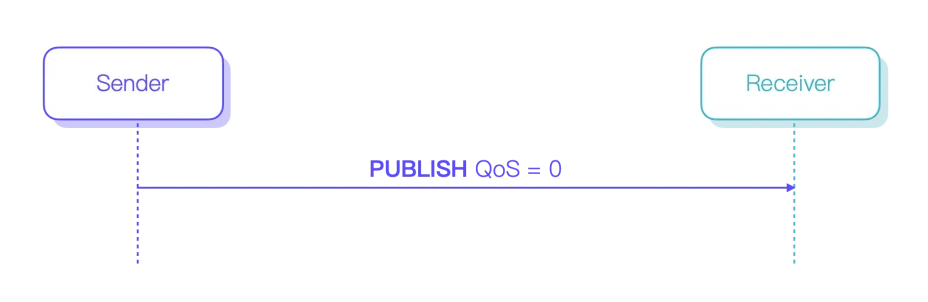
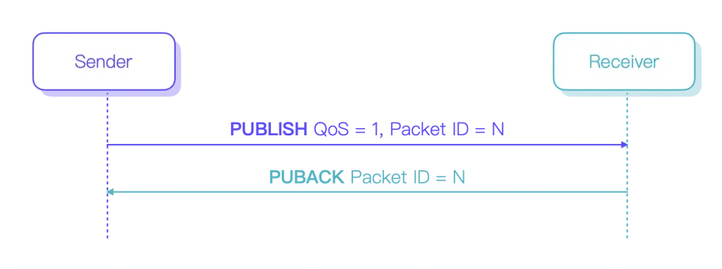
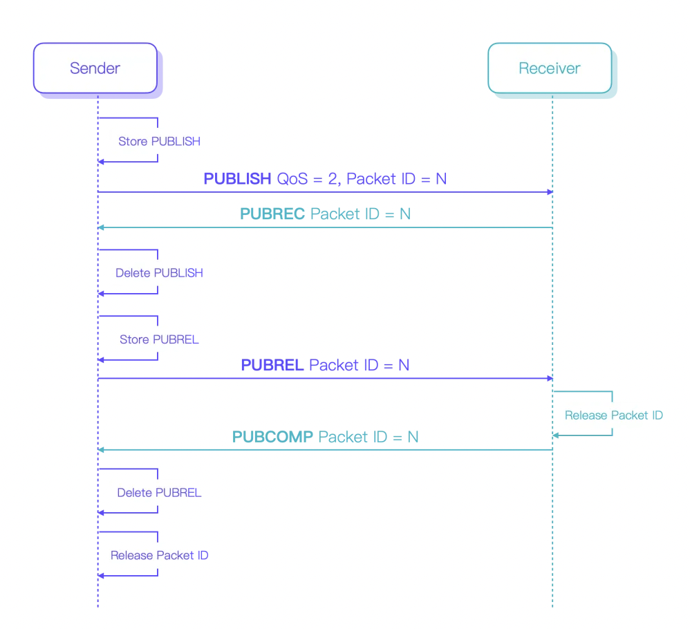

 # 一、消息队列（Message Queue)
## 1.1 什么是消息队列？
消息队列是一种异步的服务间通信方式，这里的服务也可以理解为不同线程/进程。这种通信方式有这样几个特征：
1. 消息队列是**点到点**的传输，发送方提交Message到MQ，接收方从MQ中取出Message进行消费；
2. 消息及相关信息在被消费或删除之前一直**存储**在队列上；
3. 按照一定的**顺序**（例如时间或重要性）进行排序。
4. 每条消息一般仅可被一位用户消费一次。
5. 消息队列本身是**异步**的，它允许接受者在发送消息很长时间后，才被消费者消费（对比RPC协议们（如HTTP）都是同步的，客户端在请求后并需等待服务端返回响应）。

>可以看到由于中间的Message是由Queue存储的，并没有进行持久化，因此一般这种类型对Message大小和流量是有限制的，超出限制后，Queue可能会进行阻塞，或者丢弃消息，当然各个产品实现细节可能不尽相同。
>
> 另外，由于消费者是需要自己定时去轮询队列进行消费的，因此也能控制下游服务的压力，将消息积压在队列中，再不丢消息的情况下，整体上会表现出对上游压力的削峰，提升服务稳定性。

## 1.2 和其他服务通信方式的区别
消息队列最大的功劳应该是它解耦了服务发布方和订阅方，试想这样一个场景：
一个商城系统，用户在支付完成后涉及到多个服务，比如：
1. 订单系统需要记录订单
2. 积分系统需要增加积分
3. 通知系统需要通知用户确认地址、商家确认新订单
4. 仓库系统需要统计出库

……
如果我们使用RPC，线性处理后面几个服务，那么：
1. 接口时间过长，影响用户体验
2. 一旦有某个服务挂了，整个流程都会被阻塞（试想长时间的retry），并且由于上下游耦合，有可能经常因为某个小模块挂了导致整个流程失败；
3. 如果服务挂了就将这一单置为失败，那么用户体验会变差，降低用户体验；如果要在后台重试，那么需要额外开发存储失败记录并重试逻辑，耦合的这部分存储成本并不优雅，同时大家都知道这种情况下多模块之间一旦有接口之间的变动有多痛苦……

消息队列就是这种场景的一个解决方案，上游只需要将Message发送到对应MQ，下游服务消费即可。

## 1.3 消息队列的实现
目前消息队列所使用的协议有很多种，例如最简洁的MQTT，以及更加丰富的AMQP。

基于不同的协议有不同的产品， 如Apache ActiveMQ、Apache RocketMQ、Alibaba RocketMq、RabbitMQ、Kafka、HTTPSQS等。

# 二、MQTT协议
MQTT（Message Queuing Telemetry Transport）是IBM开发的一个应用层即时通讯协议(MQTT是在TCP传输协议之上的)，据 Arlen Nipper 在 IBM Podcast 上的自述，MQTT 原名是 MQ TT，注意 MQ 与 TT之间的空格。这是九十年代早期他在参与 Conoco Phillips 公司的一个原油管道数据采集监控系统（pipeline SCADA system）时开发的一个实时数据传输协议。它的目的在于让传感器通过带宽有限的 VSAT ，与 IBM 的 MQ Integrator 通信。由于 Nipper 是遥感和数据采集监控专业出身，所以按业内惯例取了 MQ TT 这个名字。

它有这样几个特点：
1. **基于发布/订阅**实现，因此可以支持一对多的消息分发机制，消息通过MQTT Broker分发到各个Subscriber；
2. **轻量级协议**，数据包更小，实现简单，在计算和内存资源需求上需求也就更少，在资源受限的设备上运行会非常高效；
3. MQTT一般是不会存储队列；
4. **双向通信**，各个Subscriber可以向topic发布消息，也可以订阅接收topic上的消息；
5. **

## 2.1 消息服务质量等级QoS（Quality of Service）
MQTT的设计目标就是为了资源最紧缺的设备也能够安全运行，考虑设备所在网络的不确定性，MQTT 协议提供了 3 种消息服务质量等级（Quality of Service），保证了在不同的网络环境下消息传递的可靠性：

1. QoS 0：消息最多传递一次。
发布者发送一条消息之后，就不再关心它有没有发送到对方，也不设置任何重发机制，因此消息传递完全依赖于TCP，可靠性较差，如果TCP关闭或重置都会丢失缓冲区消息，但接收方消费的消息不会重复。 

2. QoS 1：消息传递至少 1 次。
包含了简单的重发机制，发布者发送携带的Packet ID的消息，然后等待接收者的 ACK，如果收到携带相同Packet ID的 ACK 则从缓存中删除该消息，否则重新发送消息。
这种模式能保证消息至少能到达一次，但如果由于网络问题丢失了ACK，那么消息可能会被重复发送。

3. QoS 2：消息仅传送一次。
设计了重发和重复消息发现机制，保证消息到达对方并且严格只到达一次。但这种方法意味着要使用类似三次握手的机制反复确认消息的接收情况，传输效率相应也就会降低。
比如Qos1，前半段流程是类似的，区别在于在发送方收到对应ACK后，还需要额外发送一次PUBREL报文，通知接收方准备释放这个Packet ID，接收方也需要存储Packet ID，对于

## 2.2 MQTT vs 其他协议
### 2.2.1 MQTT vs HTTP
MQTT 的最小报文仅为 2 个字节，比 HTTP 占用更少的网络开销。
MQTT 与 HTTP 都能使用 TCP 连接，并实现稳定、可靠的网络连接。
MQTT 基于发布订阅模型，HTTP 基于请求响应，因此 MQTT 支持双工通信。
MQTT 可实时推送消息，但 HTTP 需要通过轮询获取数据更新。
MQTT 是有状态的，但是 HTTP 是无状态的。
MQTT 可从连接异常断开中恢复，HTTP 无法实现此目标。

### 2.2.2 MQTT vs XMPP
MQTT 协议设计简单轻量、路由灵活，将在移动互联网、物联网消息领域，全面取代 PC 时代的 XMPP 协议。

MQTT 报文体积小且编解码容易，XMPP 基于繁重的 XML，报文体积大且交互繁琐。
MQTT 基于发布订阅模式，相比 XMPP 基于 JID 的点对点消息路由更为灵活。
MQTT 支持 JSON、二进制等不同类型报文。XMPP 采用 XML 承载报文，二进制必须 Base64 编码等处理。
MQTT 通过 QoS 保证消息可靠传输，XMPP 主协议并未定义类似机制。
