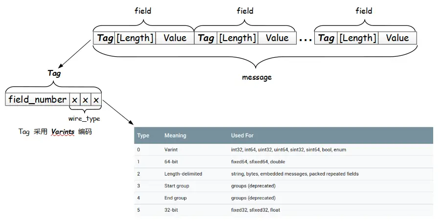
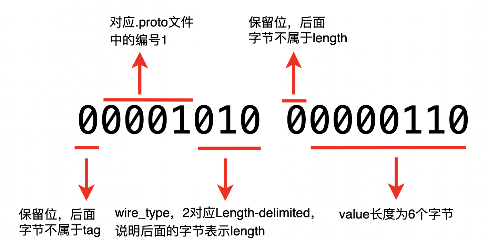

# 什么是gRPC协议
[gRPC](https://grpc.io/) 是一个由Google开发的高性能开源的RPC框架，基于HTTP/2协议标准设计，支持GO，C++，JAVA，Python等多种语言。我们之前已经介绍过了RPC框架，见[详解RPC](https://null-528.github.io/post/b9eb0f9.html)，gRPC整体流程和RPC是完全一致的：


gRPC使用谷歌自家开源的Protocol Buffers(protobuf)作为信息描述格式。因此我们需要先来学习一下protobuf。

# 什么是Protobuf
协议缓冲区Protobuf(Protocol Buffers)是一种免费开源的跨平台数据格式，用于序列化结构化数据。（From [Wiki](https://en.wikipedia.org/wiki/Protocol_Buffers)）它与 JSON 或XML 类似，只是体积更小、速度更快，而且能生成本地语言绑定。

在通信管道上，protobuf 使用ASCII码，通过纯二进制的方式进行传输。由于其紧凑的数据结构，在传输数据时，能够节省带宽、提高传输性能，但同时也意味着相比 JSON 和 XML 这种字符文本形式，protobuf丧失了可读性，也就是说，如果没有外部规范文件.proto，就无法知道字段的名称、含义或完整数据类型。

由于上述特性，protobuf非常适合用于高效RPC传输的场景。发送端和接收端使用相同的一份.proto文件，发送端将数据通过.proto文件中定义的格式对数据进行序列化，然后发送给接收端，接收端通过.proto文件对数据进行反序列化。

# protobuf详解
例如我们有一个后缀为 .proto 的普通文本文件，里面定义了Field对象的相关字段：
``` protobuf
syntax = "proto3";
package xxx.proto;

option java_package = "xxx.proto";

message Field {
    optional string metric = 1;
    optional string field = 2;
    enum Type {
        IMAGES = 0;
        WEB = 1;
  }
}
```
|  字段   | 含义                                                               |
|:-----:|------------------------------------------------------------------|
| syntax | protobuf的版本，目前支持proto2和proto3，默认为proto2。在我们这篇文章中的case都使用proto3版本 |
| package | 用来声明包避免命名冲突，如果使用的是JAVA，那么等效于java_package。                        |

> 在不同的语言中都有不同option来定制化一些内容，例如java还有：
>  - java_multiple_files：默认为false。设置是否生成多个文件，如果为true，那么每个message对象都会生成一个.java文件。
>  - java_outer_classname：在单文件的情况下，设置生成的.java文件名称，即多个message对象的外部类名称。如果没有设置的话，会将.proto文件名的驼峰写法作为文件名。
>  - java_generate_equals_and_hash：默认false，设置是否生成equals和hashCode方法。
>  - java_generic_services：默认false，设置是否生成泛型服务。
>
>  其他语言中也有对应的option，例如：
>  - csharp_namespace：设置C#的命名空间。
>  - go_package：设置Go的包名。
>  - py_generic_services：默认false，设置是否开启Python的泛型服务。
>  - ruby_package：设置Ruby的包名。
> 
> 需要注意，proto2和proto3具体option是有区别的，具体可以参考[官方文档](https://developers.google.com/protocol-buffers/docs/proto）

## 字段类型
很多标准的简单数据类型供字段可用，常用的有double、float、uint32、uint64、bool、string、bytes、uint32、uint64、enum以及其他在文件中定义的message类型。

- int32、int64：如果负数指定这两个类型编码效率较低。负数应该使用下面的类型。
- sint32、sint64：对负数会进行ZigZag编码提高编码效率。
- fixed32、fixed64：总是4字节和8字节
- sfixed32、sfixed64：总是4字节和8字节
- enum：枚举类型，对应的字段编号必须从0开始，其对应的枚举值会作为默认值。

因为采用Varint编码4个字节能表示的最大数字就是228-1了，超过这个值就需要5个字节来表示。因此对于大于228-1的数，采用固定长度fixed32或者fixed64的效率会更高。

## 字段编号
需要给每一个字段赋予一个整数作为编号，用来唯一指定二进制中的field。传输的时候只会使用这个编号，具体的信息，如字段名称、类型等，是通过传输双方共有的.proto文件来确定的。这样就节省了一些带宽空间，也避免了不同语言中表示字段类型大小不同的冲突。

所以编号一旦正式使用就不支持修改,**否则就相当于删除了这个字段，然后创建了一个相同类型但不同编号的新字段**。就算真的要删除这个字段，这个字段在使用时忽略即可，不要删除，否则可能导致新增字段不小心重复编号。

使用限制：
1. 给定的编号在该对象的所有字段中必须是唯一的。
2. 字段编号 19,000 至 19,999 保留给协议缓冲区实现。如果在报文中使用了这些保留字段编号，协议缓冲区编译器将发出报警。
> 一般我们会从1开始依次递增+1编号，因为较低的字段编号传输时中占用的空间较少。例如，字段编号范围为 1 至 15 的字段编号只需一个字节进行编码。16 至 2047 范围内的字段编号需要两个字节。

## 字段规则
目前支持optional和required、repeated。
- optional表示该字段非必填，可以为空。
- required表示该字段必填，不能为空。
- repeated表示该字段可以重复多次，包括零次，相当于数组。

## 序列化
上面代码已经体现，protobuf的数据结构格式（schema）叫做message，它表示定义一个对象,一个消息(message)是包含一系列类型字段的k-v对。想象我们需要将这些数据序列化为二进制串，那么需要知道每个字段对应的起止位置、名称和对应的值。

所以**报文的二进制版本会将字段编号作为键，解码端通过.proto文件来确定每个字段的名称和声明类型。**即以T-L-V（Tag - Length - Value）表示单个字段field，最终将所有数据拼接成一个紧凑的字节流：



### Tag
先来看Tag，它由两部分组成，最后整体通过Varints编码：
- field_number：字段编号，见1.1.2节。
- wire_type：protobuf编码类型，目前protobuf定义了6种，见上表（其中Start group和End group已经被废弃）。序列化和反序列化时会选择对应的编码方式，编码对象为最终的Value。

tag至少占用一个1字节，如果field_number大于15，那么需要多占用2个字节。其中最高位用于Varint编码保留，确认下一个字节是否需要。另外wire_type占用4个bit，field_number占用剩余的bit。

### Length & Value
length表示Value的长度，但并不是必填，可以根据message使用的数据类型来判断value长度。**但如果tag中选择wire_type为Length-delimited，那么表示value是变长的数据类型，如string，所以length是必填的。**

## 编码
前文提过，protobuf现在支持的编码方式只有4种，分别是Varint、Fixed32、Fixed64和Length-delimited。对于文本类型，直接根据ASCII码转为二进制即可，但对数字类型稍微复杂些：

### Varint
Varint编码方式是最常用的数字编码方式，举个例子：
```markdown
int32 a = 251;

数字251的二进制补码表示为：
0000 0000 0000 0000 0000 0000 1111 1011

使用varint编码：
1.以7位1组单位逆序：
111 1011 000 0001 0000 0000 0000 0000 00

2.7位1组，第一位高位为msb(most significant bit)表示是否需要下一个字节，这里第一个字节需要下一个字节，故第一个字节补高位为1。第二个字节不需要第三个字节了，故第二个字节补高位为0
1111 1011 0000 0001 0000 0000 0000 0000 00

故数字251的varint编码为：
1111 1011 0000 0001

十六进制表示为：
0xFB01
``` 
可以看到，每个字节中的最高位都需要保留，因此4个字节最多可以表示2^28-1，超过这个数就需要增加一个字节，降低一定编码效率。

### ZigZag
另外，容易想到，如果要表示的负数，原来的最高位是符号位，这样就发生了冲突，或者占用2个bit就进一步压缩了能表示的数字范围，会有更大的几率需要增加额外字节，因此Varint编码方式只适用于正数，对于负数，需要使用ZigZag编码，**有符号整数映射到无符号整数，然后再使用 Varints 编码。**映射关系为：

- Zigzag(n) = (n << 1) ^ (n >> 31),  n为sint32时
- Zigzag(n) = (n << 1) ^ (n >> 63),  n为sint64时

```markdown
uint32 a = -1;

-1的二进制编码：
1111 1111 1111 1111 1111 1111 1111 1111

n << 1后为：
1111 1111 1111 1111 1111 1111 1111 1110

n >> 31后为：
1111 1111 1111 1111 1111 1111 1111 1111

故(n << 1) ^ (n >> 31)后为：
1111 1111 1111 1111 1111 1111 1111 1110
1111 1111 1111 1111 1111 1111 1111 1111----两行执行不进位的半加操作
0000 0000 0000 0000 0000 0000 0000 0001

故:Zigzag(-1) = 1;
```

## 反序列化解析
那么对于一整个message结构体:
```protobuf
message Test
{
    required string name = 1;
}
```
我们有一个根据这个.proto文件生成的二进制串：
```markdown
十六进制：
0a06 5374 6576 656e

二进制表示为：
00001010 00000110 01010011 01110100 01100101 01110110 01100101 01101110
```
先分析前两个字节，在这个case中即tag和length



再来看value，即后面的6个字节，分别对应ASCII码：`83 116 101 118 101 110`，对照ASCII码表得到的字符串为： `Steven`。

# service
除了message之外，proto文件中还可以定义service，用来定义远程调用的方法：
```
service Computer {
  rpc ping (Empty) returns (ServerStatus) {}

  rpc compute (stream ComputeRequest) returns (stream ComputeResponse) {}
}
```
上面的service中定义了两个方法，我们分别来看一下：

## 简单rpc
ping()方法，参数为Empty，返回值为ServerStatus。具体这两个对象需要在.proto文件中去详细定义。整个过程和平常的函数调用一样。

## 流式rpc
注意到第二个方法，compute()，参数为stream ComputeRequest，返回值为stream ComputeResponse。通过在参数和返回值前加上stream关键字，表示这是一个流式rpc。

- 如果只在入参部分使用stream关键字，说明是一个客户端流式RPC，即客户端使用流将一个消息序列发送给服务端，然后服务端返回一个响应；
- 反过来，如果只在返回值部分使用stream关键字，说明是一个服务端流式RPC，即客户端在发送请求后，使用流从服务端获取响应，直到流中没有其他消息为止。
- 如果同时使用stream关键字，则表示双向流式RPC，即客户端和服务端都使用流将消息序列发送和接收。这两个流是独立操作的，因此客户端和服务器可以按任意顺序发送和接收消息。比如：服务器可以在写入响应前等待接收到所有的请求消息，或者可以交替读取和写入消息，或者以任何顺序读取和写入。

# 限制
可以看到，message这种结构体在传输时，需要一次性加载到内存中进行解析，因此只适合用于传输几兆字节的小数据块，如果报文太大，应该考虑其他的方法，比如流式传输。